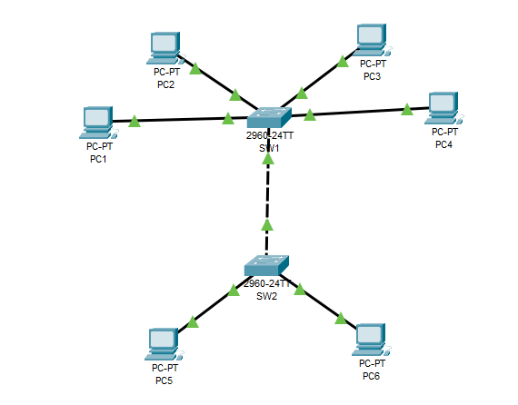
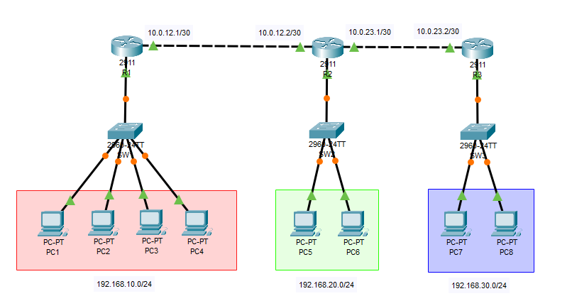
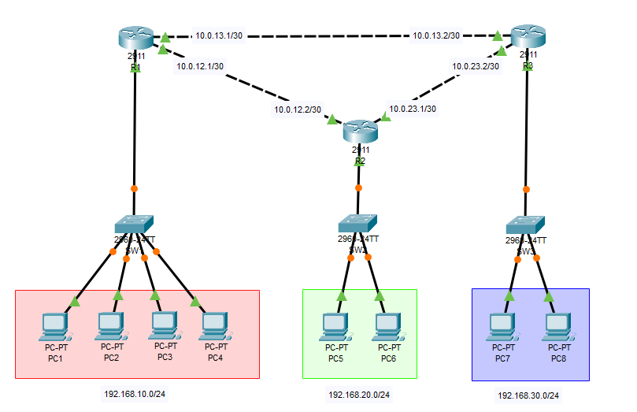
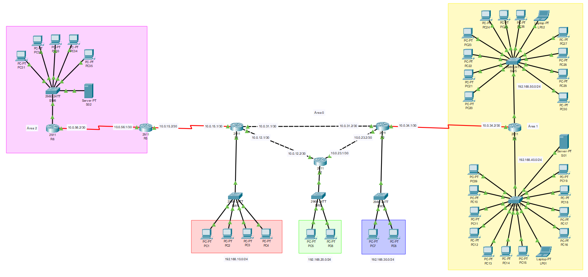
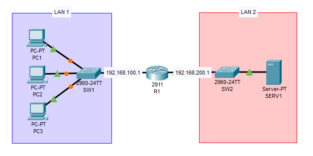

# 🌐 Práticas de Redes de Comunicação I — FT UNICAMP


Repositório com os roteiros e relatórios dos laboratórios práticos da disciplina **Redes de Comunicações I**, desenvolvidos no **Cisco Packet Tracer**.

**Integrantes:**
- André Luiz Clemente de Oliveira — 269943
- Felipe Kenji Ouba Fukuzono — 240040

---

## 📁 Estrutura do repositório

```
├── Lab-2-Fundamentos/
├── Lab-3-RoteamentoEstatico/
├── Lab-4-RoteamentoDinamicoOSPF/
├── Lab-5-VLANs/
├── Lab-6-AplicacoesERoteamentoInte.../
└── Topologia/
    ├── Lab-2.png
    ├── Lab-3.png
    ├── Lab-4.png
    ├── Lab-5.png
    └── Lab-6.png
```

Cada pasta `Lab-N` contém o roteiro da atividade e o relatório correspondente (`.pdf`/`.pkt`), enquanto a pasta `Topologia/` reúne as imagens das redes montadas no Packet Tracer para cada laboratório.

---

## 📶 Lab 2 — VLANs em Dois Switches

**Foco:** segmentação lógica de uma rede física usando VLANs.

- Criação de duas VLANs (**VLAN A / ID 10** e **VLAN B / ID 20**) distribuídas entre dois switches (SW1 e SW2) interligados por um link **trunk**;
- Configuração de portas em modo *access* e associação às VLANs correspondentes;
- Testes de conectividade dentro da mesma VLAN (mesmo entre switches diferentes) e entre VLANs diferentes (falha esperada, sem roteador);
- Realocação de um host (PC3) de uma VLAN para outra, validando o novo comportamento de conectividade.



**Principais aprendizados:** hosts na mesma VLAN se comunicam mesmo em switches distintos, pois pertencem ao mesmo domínio de broadcast; hosts em VLANs diferentes não se comunicam sem um roteador (inter-VLAN routing).

---

## 🗺️ Lab 3 — Roteamento Estático entre Redes

**Foco:** interligação de três LANs através de rotas estáticas configuradas manualmente.

- Três roteadores (R1, R2, R3) em topologia serial, cada um com sua própria LAN (`192.168.10.0/24`, `192.168.20.0/24`, `192.168.30.0/24`);
- Enlaces ponto a ponto entre roteadores usando sub-redes `/30`;
- Configuração de rotas com `ip route <rede> <máscara> <next-hop>` em cada roteador;
- Verificação com `show ip route` e testes fim a fim com `ping` e `tracert`.



**Principais aprendizados:** o roteamento estático funciona bem em redes pequenas, mas exige configuração manual em cada roteador para cada rede remota — não escala automaticamente.

---

## ⚙️ Lab 4 — Roteamento Dinâmico com OSPF

**Foco:** substituição das rotas estáticas do Lab 3 pelo protocolo de roteamento dinâmico **OSPF** (área única — Área 0).

- Remoção das rotas estáticas e configuração de `router ospf 1` com `network ... area 0` em cada roteador;
- Verificação de vizinhança via `show ip ospf neighbor` e das rotas aprendidas (código `O`) via `show ip route`;
- Testes de conectividade e `tracert` entre todas as LANs;
- Implementação de uma **rota redundante** (enlace R1–R3) e simulação de falha de link para observar a reconvergência automática do OSPF.



**Principais aprendizados:** o OSPF elimina a necessidade de configuração manual de rotas, se adapta automaticamente a falhas de link (via mensagens *Hello*, LSAs e recálculo SPF/Dijkstra) e escolhe caminhos com base em custo/largura de banda.

---

## 🌍 Lab 5 — OSPF Multiárea com ABR e Área Stub

**Foco:** expansão do cenário anterior para uma rede maior com **6 roteadores** e múltiplas áreas OSPF.

- Divisão da rede em **Área 0** (backbone), **Área 1** (normal) e **Área 2** (*stub*, simulando uma filial com poucos recursos);
- Configuração de roteadores de borda (**ABR**) interligando as áreas;
- Uso de portas seriais (`HWIC-2T`) para os enlaces entre roteadores de área;
- Configuração de LANs com **DHCP** (mínimo de 5 hosts por rede);
- Verificação de vizinhanças e rotas OSPF (incluindo rota *default* recebida pela área stub) e testes de conectividade fim a fim entre todas as LANs.



**Principais aprendizados:** áreas stub reduzem consumo de memória e CPU em roteadores de recursos limitados, pois recebem apenas uma rota padrão em vez de todas as rotas externas; adicionar uma nova LAN em uma rede OSPF é simples e não exige alterações nos demais roteadores.

---

## 📡 Lab 6 — Serviços de Rede: DNS, E-mail e HTTP

**Foco:** configuração de serviços de aplicação em um servidor conectado a uma rede com duas LANs interligadas por um roteador.

- Duas sub-redes IPv4 (`192.168.100.0/24` — clientes e `192.168.200.0/24` — servidor) interligadas por R1;
- Configuração de um servidor com serviços **HTTP**, **DNS** e **E-mail (SMTP/POP3)**;
- Criação de registro DNS (tipo A) para permitir o acesso ao servidor web por nome, além de por IP;
- Criação de contas de e-mail e testes de envio/recebimento de mensagens entre clientes usando o servidor da LAN 2.



**Principais aprendizados:** o DNS permite acessar serviços por nome em vez de IP, e sua má configuração impede a resolução de nomes mesmo com o servidor funcionando normalmente; a comunicação entre hosts de LANs diferentes depende de um roteador atuando como gateway.

---

## 🛠️ Ferramentas utilizadas

- **Cisco Packet Tracer** — simulação das topologias de rede;
- **CLI Cisco IOS** — configuração de roteadores e switches (interfaces, OSPF, rotas estáticas, DHCP);
- Serviços de servidor do Packet Tracer — HTTP, DNS, DHCP, E-mail (SMTP/POP3).

---

## 📄 Sobre os relatórios

Cada relatório documenta:
- Tabelas de endereçamento (LANs e enlaces);
- Saídas de comandos relevantes (`show ip route`, `show ip ospf neighbor`, `show vlan brief`, etc.);
- Evidências (prints) dos testes de conectividade (`ping`/`tracert`);
- Discussões teóricas sobre roteamento estático vs. dinâmico, VLANs, áreas OSPF e serviços de rede;
- Problemas encontrados durante a implementação e como foram resolvidos.
